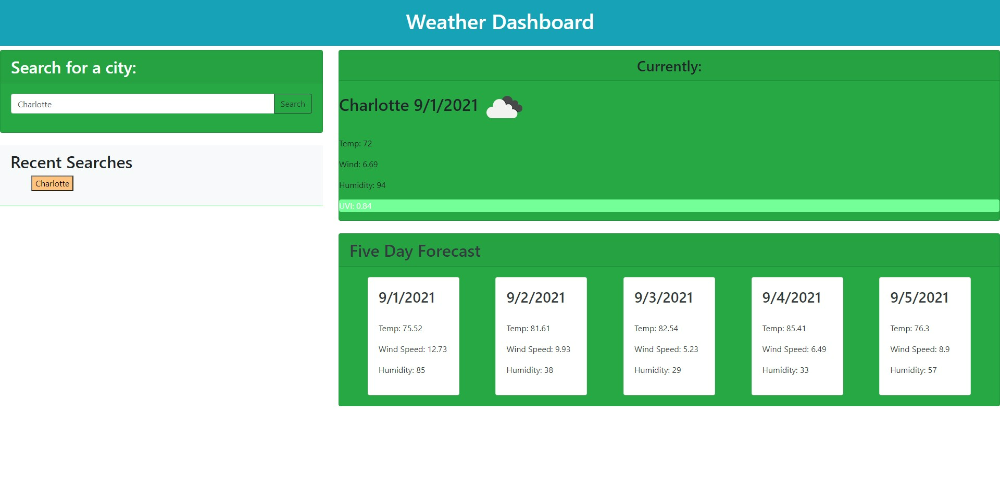

# Weather Dashboard 
 
[Link to LIVE site.](https://ashbylb.github.io/current-weather-dashboard/)

## Table of Contents
- [Description](#Description)
- [Usage](#Usage)
- [Screenshot](#Screenshot)
- [Languages](#Languages)

## Discription
Welcome to the Weather Dashboard.  Here you can access the daily weather and five day forecast of an city your would like to search.

## Usage 
Type the name of the city into the input field to the left and hit the search button.  The webpage will populate the current days weather as well as a five day forcast. You can also revisit a city you have searched by clicking the city in the recent searches area. 

## Screenshot
 

## Languages
Html and JavaScript